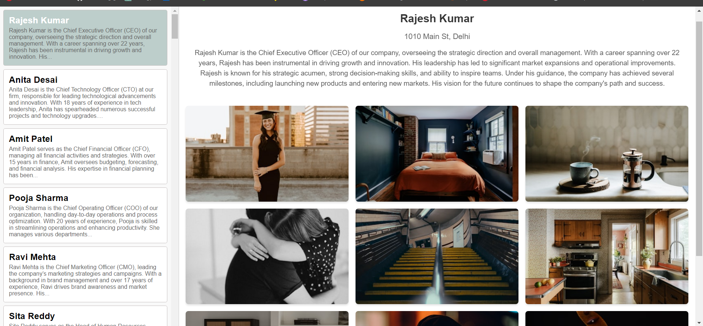
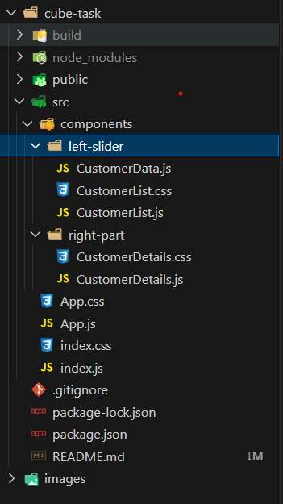

# [Customer Details Portal(Cube Assignment) Live](https://66be1341fb8e5a4019d20c81--bucolic-lokum-a60746.netlify.app/)

## Overview

This project is a single-page application developed using React and JavaScript. It displays a customer details portal with a dynamic photo grid. The application is designed to show a list of customers on the left side and display detailed information on the right side when a customer is selected. 

## Features

- **Customer List:** Displays a list of up to 1000 customers with their names and titles.
- **Customer Details:** Shows detailed information including the customer’s name, title, and address.
- **Photo Grid:** A 3x3 grid of 9 photos that updates every 10 seconds. Photos are fetched from a public API.
- **Highlighted Selection:** The selected customer card is highlighted.
- **Responsive Design:** The application is designed to be responsive and user-friendly.

## Technologies Used

- React
- JavaScript
- HTML
- CSS
- Axios (for API requests)
- Netlify (for deployment)

## File Structure

## Contact
-If any queries please contact me at [kumaralok47ak@gmail.com](mailto:kumaralok47ak@gmail.com)
